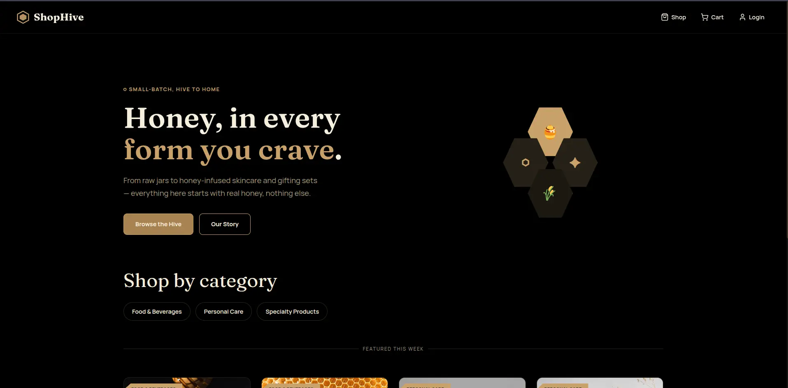
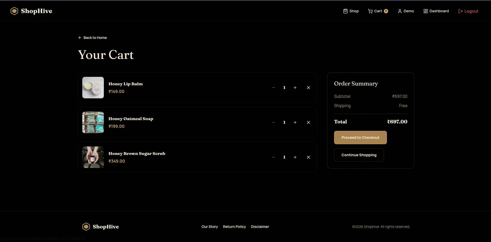
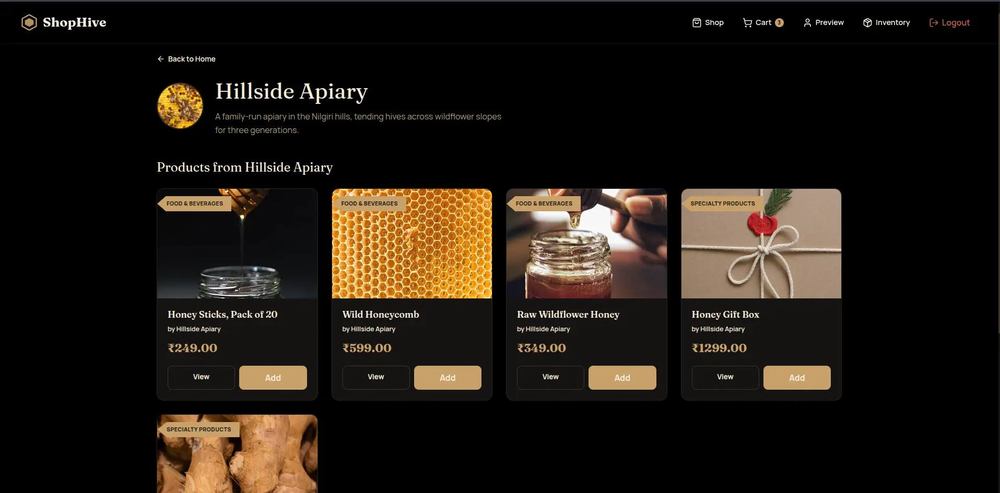
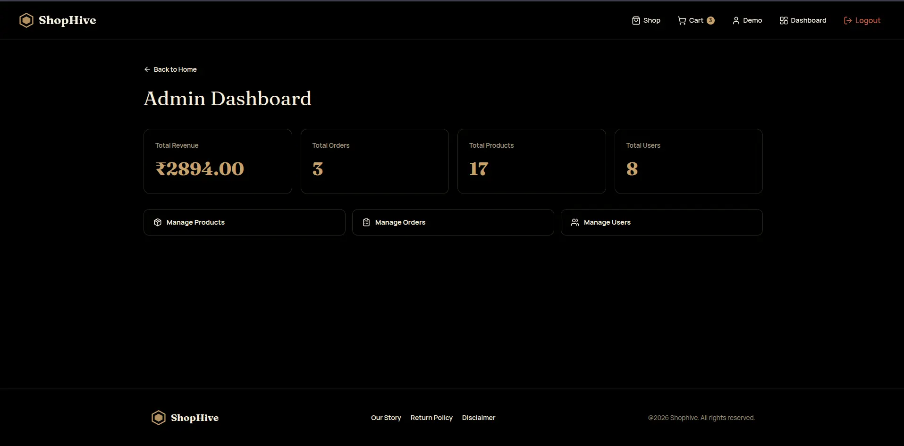

# ShopHive

**ShopHive** is a full-stack multi-vendor honey and botanicals e-commerce platform built as a monorepo with a React/Vite frontend and an Express/MongoDB backend.

* **Live Demo:** [shophive-wct6.onrender.com](https://shophive-wct6.onrender.com/)
* **Repository:** [github.com/harshrajput-0/shophive](https://github.com/harshrajput-0/shophive.git)

---
## Preview

### Customer Experience






### Vendor Experience



### Admin Experience

---

## Interactive Demo & Preview Accounts

Two **preview accounts** (`isMock: true`) are seeded in the database. 

| Role | Email | Password | Access & Permissions |
| :--- | :--- | :--- | :--- |
| **Admin** | `demo-admin@shophive.com` | `preview123` | Access to `/admin` routes (manage products, orders, users, and roles). |
| **Vendor** | `demo-vendor@shophive.com` | `preview123` | Access to `/vendor-dashboard` pre-seeded with sample products ("Preview Apiary"). |


---

## Key Features

### Customer Features

* Registration and authentication (JWT-backed)
* Search, browse, and filter products across categories
* Multi-vendor shopping cart and checkout
* Integrated Razorpay payment processing and payment history
* Order status tracking (`Pending`, `Shipped`, `Delivered`)
* Customer profile management
* Product reviews

### Vendor Features

* Dedicated vendor dashboard
* Public vendor storefront
* Product CRUD operations
* Cloudinary image uploads
* Vendor-specific sales and earnings analytics
* Vendor order management

### Admin Features

* Platform-wide analytics dashboard
* Global user management
* User role management
* Product management (Only Delete)
* Order management
* Platform-level sales analytics

---

## Tech Stack

### Frontend

* React 19
* Vite
* Redux Toolkit
* React Router
* Tailwind CSS v4
* Axios
* Lucide React

### Backend

* Node.js
* Express 5
* MongoDB
* Mongoose
* JWT
* bcryptjs

### Storage & Media

* Cloudinary

### Payments & Mail

* Razorpay
* Nodemailer
* Gmail SMTP

---
## Get Started

### Prerequisites

Make sure you have the following installed:

* [Node.js](https://nodejs.org/) 18+
* [MongoDB](https://www.mongodb.com/) or a MongoDB Atlas database
* A [Cloudinary](https://cloudinary.com/) account
* A [Razorpay](https://razorpay.com/) account for payment processing

### 1. Clone the Repository

```bash
git clone https://github.com/harshrajput-0/shophive.git
cd shophive
```

### 2. Install Dependencies

Install the root dependencies:

```bash
npm install
```

Then install dependencies for both applications:

```bash
npm install --prefix frontend
npm install --prefix backend
```

### 3. Configure Environment Variables

Create a `.env` file inside the `backend/` directory:

```env
PORT=5000

MONGO_URI=your_mongodb_connection_string

JWT_SECRET=your_jwt_secret

CLOUDINARY_CLOUD_NAME=your_cloudinary_cloud_name
CLOUDINARY_API_KEY=your_cloudinary_api_key
CLOUDINARY_API_SECRET=your_cloudinary_api_secret

RAZORPAY_KEY_ID=your_razorpay_key_id
RAZORPAY_KEY_SECRET=your_razorpay_key_secret

EMAIL_USER=your_email
EMAIL_PASS=your_email_app_password
```

Create a `.env` file inside the `frontend/` directory if the frontend requires environment-specific configuration:

```env
VITE_API_URL=your_backend_api_url
```

> Never commit your `.env` files or expose secret keys in the repository.

### 4. Start the Application

From the **root directory**, run:

```bash
npm run dev
```

This uses `concurrently` to start both the frontend and backend development servers.

```text
Root
 │
 ├── Frontend → npm run dev --prefix frontend
 │
 └── Backend  → npm run dev --prefix backend
```

The frontend and backend will start simultaneously in the same terminal.

### 5. Build for Production

To create the frontend production build:

```bash
npm run build --prefix frontend
```

The production files will be generated in:

```text
frontend/dist/
```

---
## Project Architecture & Monorepo Structure

```text
ShopHive/
├── backend/                  # Express + MongoDB API
│   ├── src/
│   │   ├── config/           # Database & Cloudinary configuration
│   │   ├── controllers/      # Business logic
│   │   ├── middlewares/      # Authentication & authorization
│   │   ├── models/           # Mongoose models
│   │   ├── routes/           # API routes
│   │   └── utils/            # Backend utilities
│   ├── uploads               # Local upload directory
│   ├── app.js
│   └── server.js
│
├── frontend/                 # React + Vite application
│   ├── src/
│   │   ├── components/       # Reusable UI components
│   │   ├── pages/            # Customer, Admin & Vendor pages
│   │   ├── services/         # API service layer
│   │   ├── store/            # Redux Toolkit state management
│   │   ├── routes/           # Protected routes
│   │   ├── utils/            # Shared utilities
│   │   ├── App.jsx
│   │   ├── global.css
│   │   └── main.jsx  
│   ├── public/               # Static assets
│   ├── index.html
│   └── vite.config.js
│
├── package.json              # Root monorepo configuration
└── README.md